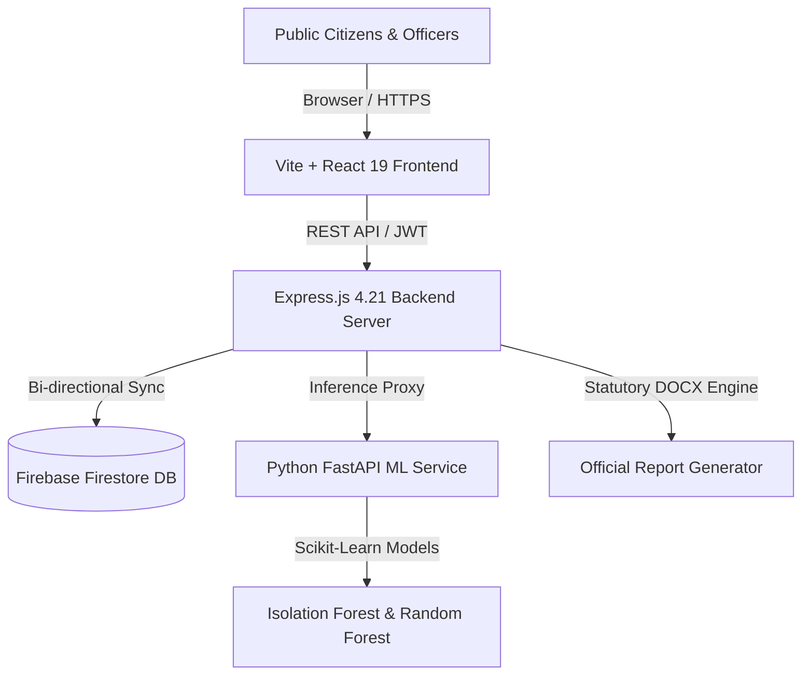

# 🏛️ MPLADS VigilAI — AI-Powered National Monitoring & Risk Intelligence Platform

[](https://react.dev/)
[](https://www.typescriptlang.org/)
[](https://nodejs.org/)
[](https://expressjs.com/)
[](https://www.python.org/)
[](https://fastapi.tiangolo.com/)
[](https://vitejs.dev/)
[](https://tailwindcss.com/)
[](https://firebase.google.com/)

> **Next-Generation Statutory Vigilance, Explainable Risk Intelligence & Real-Time Ministerial Decision Support for the Member of Parliament Local Area Development Scheme (MPLADS).**

---

## 📌 Executive Summary

The **MPLADS VigilAI** platform transforms the monitoring and governance of the Member of Parliament Local Area Development Scheme (MPLADS) administered by the **Ministry of Statistics and Programme Implementation (MoSPI)**, Government of India.

By fusing **Machine Learning (Isolation Forest & Random Forest)** with **Statutory Guideline Rulesets (MoSPI 2023 Handbook)** and **Real-Time Ministerial Directive Enforcements**, VigilAI detects financial anomalies, milestone variances, contractor cartelization, duplicate work allocations, and geo-tag discrepancies before public funds are dissipated.

---

## ⚡ Key Platform Capabilities

### 1. 🔍 Explainable Risk Decomposition (+Additive Weights)
- Decomposes holistic composite risk into six mathematically sound, strictly non-zero additive factors:
  - **Financial Anomaly (+32%)**: Expenditure vs. physical completion divergence, milestone overruns.
  - **Progress Mismatch (+24%)**: Discrepancy between PFMS treasury releases and site progress.
  - **Milestone Delay (+18%)**: Delays against statutory sanction milestones.
  - **Contractor Cartel Risk (+12%)**: Concentration of works among single entities.
  - **Duplicate Probability (+9%)**: Duplicate work sanctions at identical or nearby GIS coordinates.
  - **Data Quality & Documentation Risk (+5%)**: Missing utilization certificates or geo-photos.
- **Mathematical Guarantee**: All six factors are explainable positive integers ($\ge 1$) that sum **exactly** to the total risk score ($\sum = \text{Score}$).

### 2. ⚖️ Decision Center & Ministerial Directive Stamping
- **Real-Time Executive Enforcement**: Ministers and authorized officials can execute statutory orders:
  - ⛔ **Freeze Further Payment**: Dispatches immediate interim payment halt to PFMS treasury.
  - 📋 **Assign Technical Field Inspection**: Dispatches superintending engineers with digital checklists.
  - ⚠️ **Issue Statutory Show-Cause Notice**: Initiates contractor discrepancy inquiries.
  - ✅ **Formal Case Resolution**: Records formal reconciliation and audit closure.
- **Visual Stamping**: Dossiers feature glowing directive top-banners, colored ring borders, audit callout stamps, and locked button states.
- **Statutory Audit Trail**: Every decision is cryptographically logged with digital timestamps, actor details, and status transition history.

### 3. 🧠 5-Question Explainable AI Framework
For every flagged work, the platform answers five critical questions required by administrative law:
1. **WHAT Happened?** — Summary of detected discrepancy signal.
2. **WHY is it Unusual?** — Deviation against historical district and category benchmarks.
3. **HOW Serious is it?** — Quantified financial exposure at stake (₹ Lakhs) and statutory priority.
4. **WHAT Should the Authority Do Next?** — Recommended statutory administrative intervention.
5. **WHAT Evidence is Required?** — Checklists of measurement books, geo-photos, and vouchers.

### 4. 🤖 Dual-Engine Machine Learning Microservice
- **Isolation Forest**: Detects non-linear outliers across multivariate financial distributions.
- **Random Forest Delay Regressor**: Predicts milestone completion slippage in calendar days.
- **Benchmark Cost Intelligence**: Computes regional PWD Schedule of Rates (SoR) deviation.
- **Resilient Fallback**: Automatic seamless local ML inference when Python microservice is offline.

### 5. 👥 Role-Based Access Control (RBAC) across 8 Personas
| Role | Clearance | Decision Rights | Features Accessible |
|:-----|:---------:|:---------------:|:--------------------|
| **Union Minister** | Apex | Full Statutory Directives | Complete platform, Decision Center, Treasury freeze |
| **District Magistrate (DM)** | Executive | District Enforcement | District inspections, contractor notices |
| **District Nodal Officer** | Administrative | Field Operations | Work approvals, inspection management |
| **Member of Parliament (MP)** | Oversight | Constituency Review | Constituency dashboard, recommendation tracker |
| **Audit Analyst (CAG/MoSPI)** | Intelligence | Forensic Analysis | ML forecasts, compliance audits, DOCX export |
| **Chief Administrator** | System | User & Role Admin | User role modification, system health logs |
| **Citizen Watchdog** | Public | Social Audit Reports | Citizen portal, verified works, submit evidence |
| **Public Viewer** | Public | View-Only | Open governance portal, transparency charts |

### 6. 🗺️ Interactive GIS Mapping & Constituency Analytics
- Real-time Leaflet GIS mapping of 543 Parliamentary constituencies and district projects.
- Clustered markers color-coded by statutory risk levels (Critical, High, Moderate, Low).
- Detailed constituency breakdown of SC/ST mandatory allocations (15% SC, 7.5% ST statutory quotas).

### 7. 📱 Field Inspection Workbench & Citizen Social Audit
- Mobile-responsive digital checklist for field engineers with geo-tag coordinate validation.
- Public citizen grievance portal allowing photo proof submission and status tracking.

---

## 🏗️ System Architecture



---

## 🚀 Getting Started

### Prerequisites
- **Node.js**: v18.0.0 or higher
- **npm**: v9.0.0 or higher
- **Python**: v3.9+ (Optional, for Python ML microservice)

---

### Step 1: Clone the Repository

```bash
git clone https://github.com/jemipadodara-ai/MPLADS-VigilAI.git
cd MPLADS-VigilAI
```

### Step 2: Install Node.js Dependencies

```bash
npm install
```

### Step 3: Environment Configuration

Copy the sample environment file:

```bash
cp .env.example .env
```

Edit `.env` if you wish to configure optional API keys (e.g. `GEMINI_API_KEY`, `DATA_GOV_IN_API_KEY`). The platform operates out of the box with built-in verified MoSPI data.

### Step 4: Run the Application

#### Development Mode:
```bash
npm run dev
```
The server will start on **http://localhost:3000** with hot-module reloading enabled for both frontend and backend APIs.

#### Production Build & Run:
```bash
npm run build
npm start
```

---

### Step 5: (Optional) Run Python ML Microservice

If you wish to run the standalone Python FastAPI machine learning engine:

```bash
cd ml-service
python -m venv venv
# On Windows:
venv\Scripts\activate
# On Linux/macOS:
source venv/bin/activate

pip install -r requirements.txt
python main.py
```
The ML microservice will start on **http://localhost:8000**. If offline, the Express backend automatically runs the local ML inference engine.

---

## 🔐 Pre-Configured Demo Accounts

Use these credentials to sign in and test role-specific functionalities:

| Role | Email | Password | Clearance Level |
|:-----|:------|:---------|:----------------|
| **Union Minister** | `minister@mplads.vigilai` | `minister123` | Full statutory directive enforcement |
| **Administrator** | `admin@mplads.vigilai` | `admin123` | Complete user and role administration |
| **District Magistrate** | `district@mplads.vigilai` | `district123` | District administrative jurisdiction |
| **District Nodal Officer** | `nodal@mplads.vigilai` | `nodal123` | Field inspection & agency coordination |
| **Member of Parliament** | `mp@mplads.vigilai` | `mp123456` | Constituency monitoring & proposals |
| **Senior Audit Analyst** | `analyst@mplads.vigilai` | `analyst123` | Predictive ML forensics & DOCX export |
| **Citizen Watchdog** | `citizen@mplads.vigilai` | `citizen123` | Social audit reporting & grievance submission |
| **Public Viewer** | `viewer@mplads.vigilai` | `viewer123` | Public view-only governance dashboard |

---

## 📡 API Reference Overview

| Method | Endpoint | Description | Access |
|:-------|:---------|:------------|:-------|
| `GET` | `/api/projects` | List all monitored works | All |
| `POST` | `/api/projects` | Create a new monitored project record | Officer+ |
| `PATCH` | `/api/projects/:id` | Update project details / progress | Officer+ |
| `DELETE` | `/api/projects/:id` | Soft-delete a project record | Admin / Minister |
| `GET` | `/api/cases` | Retrieve active vigilance dockets | All |
| `POST` | `/api/cases/action` | Execute statutory ministerial directive | Minister / DM / Admin |
| `GET` | `/api/inspections` | Fetch field inspection records | Officer+ |
| `POST` | `/api/inspections` | Schedule a new technical inspection | Officer+ |
| `PATCH` | `/api/inspections/:id`| Update checklist items / upload findings | Inspector / Officer |
| `POST` | `/api/citizen-reports`| Submit crowdsourced social audit report | Public / Citizen |
| `GET` | `/api/ml/health` | Python ML microservice health status | All |
| `POST` | `/api/ml/predict/batch`| Batch ML anomaly & delay predictions | Officer+ |
| `GET` | `/api/users` | List registered users & clearances | Admin only |
| `PATCH` | `/api/users/:id/role` | Modify officer authorization role | Admin only |
| `GET` | `/api/notifications`| User-specific real-time alert notifications | Authenticated |

---

## 🧪 Testing & Verification

Run TypeScript compilation check:
```bash
npm run lint
# Exit code 0 (0 errors)
```

Run production bundle build:
```bash
npm run build
# Compiles Vite frontend + esbuild server bundle (dist/server.cjs)
```

---

## 📜 Statutory Alignment & Guidelines

This system is built in strict adherence to:
- **Revised MPLADS Guidelines (February 2023)** issued by MoSPI, Govt of India.
- **PFMS (Public Financial Management System)** single-nodal account disbursement regulations.
- **Section 23 & 24** of the MPLADS Operational Manual regarding mandatory technical field inspections and social audits.

---

## 📄 License

This project is licensed under the [MIT License](LICENSE). Built for public transparency, statutory integrity, and national development.

